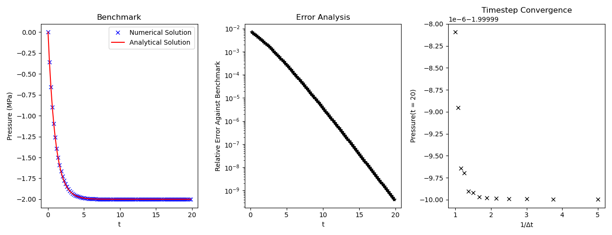
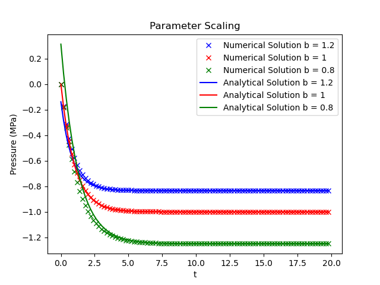
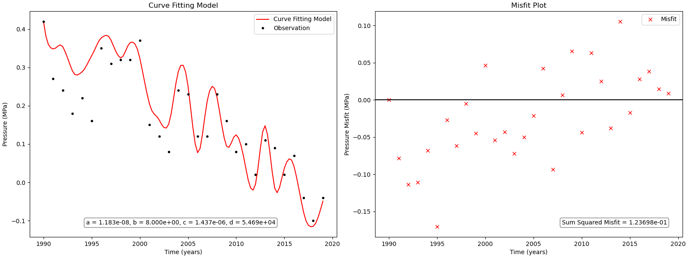
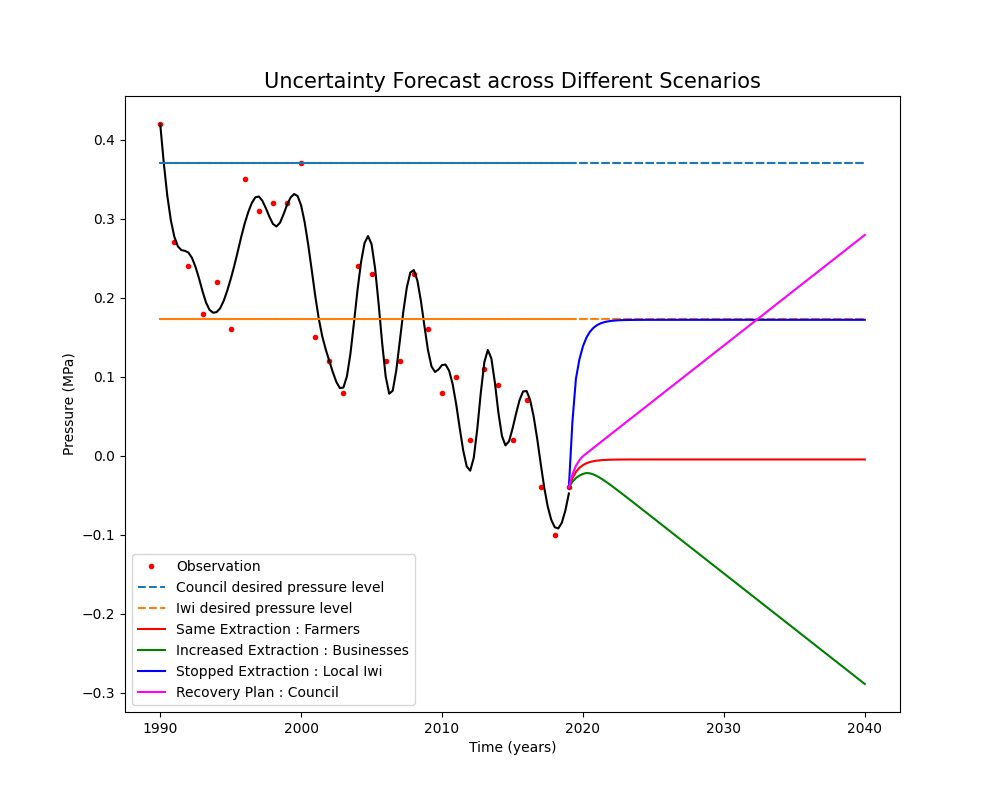
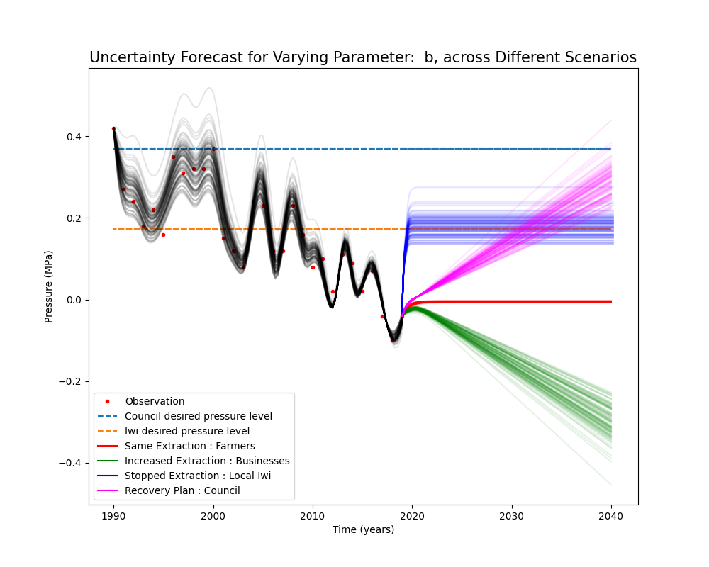

Aquifer Pressure Modeling Project

## Overview
This project models, analyzes, and forecasts aquifer pressure dynamics to support sustainable water management for diverse stakeholders. The workflow and results are explained below, with each process illustrated by the corresponding plots generated by the analysis.

## 1. Model Design
The aquifer model simulates pressure dynamics relative to the ocean, accounting for water extraction, recharge (from both a freshwater spring and the ocean), and slow drainage effects. The model assumes a homogeneous aquifer with constant recharge, no interaction between recharge sources, and no geological evolution over time. The governing ODE is:

    dP/dt = -a*q - b(P-P₀) - c*dq/dt + d

where P is aquifer pressure, q is extraction rate, P₀ is initial pressure, and dq/dt is the rate of change of extraction. Parameters a, b, c, and d are estimated through curve fitting, each representing a physical process (direct extraction effect, recharge, slow drainage, and spring contribution, respectively).

## 2. Model Benchmarking & Convergence
The ODE model is benchmarked against its analytical solution to verify stability and accuracy. The numerical solution closely matches the analytical benchmark, with errors decreasing exponentially over time and improved accuracy at smaller timesteps. This confirms the model’s reliability for further analysis.

## 3. Parameter Scaling
Parameter scaling focuses on the recharge parameter b, which controls how quickly the aquifer pressure returns to equilibrium. As b increases, the influence of ocean recharge strengthens, causing faster stabilization of pressure. This behavior is validated through parameter scaling plots.

## 4. Model Fit and Parameter Optimization
Parameters a, b, c, and d are estimated using both manual calibration and automated curve fitting. The model fit is evaluated by comparing simulated and observed pressure data, with the sum of squared errors reduced to 1.235×10⁻¹, an improvement of over 1×10¹³ compared to initial estimates. This demonstrates the model’s ability to accurately capture aquifer dynamics.

## 5. Scenario Simulation and Forecasting
The model simulates future aquifer pressure under four stakeholder-driven scenarios: maintaining current extraction (farmers), increasing extraction (businesses), halting extraction (iwi), and a staged recovery plan (council). The council’s plan is projected to restore aquifer pressure to 2000s levels by 2070, balancing economic and environmental needs.

## 6. Uncertainty Analysis
Uncertainty is quantified by analyzing the impact of parameter b, which has the highest uncertainty due to its dependence on poorly known aquifer properties. The model propagates this uncertainty through to the forecasts, showing a range of possible outcomes and reinforcing the robustness of the recommended management strategy.

## 7. Stakeholder Impact and Recommendations
The model’s outputs inform decision-making for all stakeholders. The council’s staged reduction plan is recommended, as it achieves environmental sustainability and economic stability with minimal disruption. The model’s scenario and uncertainty analyses provide a strong foundation for balanced, data-driven water management decisions.
